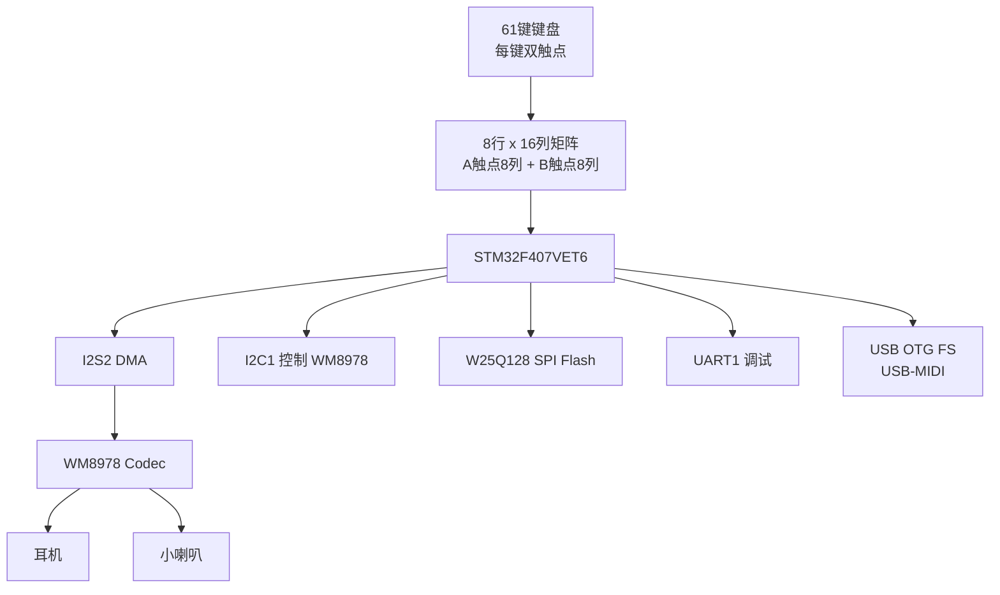

# 61 键电子琴 · 第二档 DIY 方案

> 目标：不做蜂鸣器玩具，做一把“像样的电子琴”：61 键、带力度、多复音、真实音色（波表合成起步）、耳机/喇叭输出，预留 USB-MIDI。
> 适用人群：已经玩过 STM32F103 + HAL，想往上走一档。

---

## 1. 产品规格（本方案锁定）

| 项目 | 指标 |
|------|------|
| 键数 | 61 键（C2 ~ C7，MIDI 36 ~ 96，5 个八度） |
| 复音 | 16 ~ 32 voice（目标 32，优化后 64） |
| 力度 | 有（双触点时间差检测，1 ~ 127） |
| 音色 | 波表合成起步：钢琴类 EP / 风琴 / 弦乐 / 方波 lead 等 |
| 采样率 | 48 kHz，16bit，立体声 |
| 输出 | 耳机 + 内置小喇叭（WM8978 直接驱动） |
| 接口 | USB-MIDI、调试串口 |
| 主控 | STM32F407VET6（168MHz，带 FPU，192KB RAM，512KB Flash） |
| 音频 Codec | WM8978（I2S + I2C 控制，集成耳机功放与喇叭功放） |
| 采样库存储 | W25Q128（16MB SPI Flash，可选/后续采样库用） |

> 换芯片说明：F407VET6 开发板/最小系统板便宜且引脚多，是这档最合适的起步平台。若已有 F405RGT6 / F411，也可以，但 F411 引脚少，61 键矩阵会紧张。

---

## 2. 系统架构



信号链路：按键矩阵扫描 -> 力度计算 -> Note On/Off 事件 -> 波表合成 + ADSR + 混音 -> I2S DMA -> WM8978 -> 耳机/喇叭。

---

## 3. 硬件选型清单

| 模块 | 器件 | 说明 |
|------|------|------|
| 主控 | STM32F407VET6 最小系统板 | 100pin，168MHz，FPU |
| 音频 | WM8978 模块（如 GY-WM8978） | I2S 音频 + I2C 控制，耳机/喇叭双输出 |
| 采样存储 | W25Q128 | 16MB SPI Flash，第二期放采样库 |
| 键盘 | 61 键力度键盘总成 | 每键两个导电胶触点 |
| 二极管 | 1N4148 × 122 | 每个触点串一个，防鬼键 |
| 调试 | ST-Link / USB-TTL | SWD 下载 + PA9/PA10 串口 |
| 电源 | 5V 2A + 3.3V LDO | 功放和数字分开供电 |
| UI（可选） | OLED 或 1602、旋转编码器 | 显示音色/音量/模式 |

---

## 4. 引脚规划（STM32F407VET6）

| 功能 | 引脚 | 说明 |
|------|------|------|
| 键盘行 R0~R7 | PE0 ~ PE7 | 8 路输出，逐行拉低 |
| 键盘列 A0~A7 | PC0 ~ PC7 | 触点1 输入，内部上拉 |
| 键盘列 B0~B7 | PD8 ~ PD15 | 触点2 输入，内部上拉 |
| I2S2_WS | PB12 | 接 WM8978 LRCK |
| I2S2_CK | PB13 | 接 WM8978 BCLK |
| I2S2_SD | PB15 | 接 WM8978 DACDAT |
| I2S2_MCK | PC6 | 接 WM8978 MCLK |
| I2C1_SCL | PB8 | WM8978 控制 |
| I2C1_SDA | PB9 | WM8978 控制（7bit 地址 0x1A） |
| SPI1_FLASH | PA4(NSS) PA5(SCK) PA6(MISO) PA7(MOSI) | W25Q128 |
| UART1 | PA9(TX) PA10(RX) | 调试 115200 |
| USB OTG FS | PA11(D-) PA12(D+) | USB-MIDI |
| UI | PC8 PC9 PC10 PC11 ... | 编码器/按键/屏 |

> 键盘排线矩阵顺序每个键床不一样，先用“自检程序”打印 行列->MIDI 对应关系再固化映射表。

---

## 5. 固件模块划分

```
Core/Src/
  main.c            初始化 + 主循环（UI / 调试 / MIDI 输出）
  keyboard.c        键盘矩阵扫描、消抖、力度计算、事件队列
  synth.c           复音管理、波表振荡器、ADSR、滤波、混音
  audio_i2s.c       I2S2 DMA 双缓冲 + 渲染回调
  codec_wm8978.c    WM8978 初始化、音量、输出通道
  flash_w25q.c      SPI Flash 驱动（采样库用）
  midi.c            USB-MIDI / 串口 MIDI
  ui.c              屏、按键、旋钮
```

### 5.1 键盘扫描 + 力度检测

每个键两个触点。扫描顺序：先检测哪个触点先闭合，再测量另一个触点闭合的时间差 `dt`，`dt` 越小力度越大。

```c
typedef enum { K_IDLE, K_FIRST, K_ON } KeyState;

typedef struct {
    KeyState state;
    uint16_t t_first;   // 第一个触点闭合时刻(tick)
    uint8_t  note;      // MIDI 音符号
    uint8_t  velocity;
} Key;

void Key_Scan(void)
{
    for (int row = 0; row < 8; row++) {
        DriveRowLow(row);               // 当前行拉低
        uint8_t colA = ReadColA();      // 触点1 状态
        uint8_t colB = ReadColB();      // 触点2 状态
        DriveRowHighZ(row);

        for (int col = 0; col < 8; col++) {
            int idx = row * 8 + col;
            bool c1 = !(colA & (1 << col)); // 低有效
            bool c2 = !(colB & (1 << col));
            bool pressed = c1 || c2;

            switch (Key[idx].state) {
            case K_IDLE:
                if (pressed) { Key[idx].t_first = Tick; Key[idx].state = K_FIRST; }
                break;
            case K_FIRST:
                if (c1 && c2) {           // 两个触点都已闭合
                    uint16_t dt = Tick - Key[idx].t_first;
                    Key[idx].velocity = VelocityMap(dt);
                    Event_NoteOn(Key[idx].note, Key[idx].velocity);
                    Key[idx].state = K_ON;
                } else if (!pressed) {    // 误触，恢复
                    Key[idx].state = K_IDLE;
                }
                break;
            case K_ON:
                if (!c1 && !c2) {         // 完全松开
                    Event_NoteOff(Key[idx].note);
                    Key[idx].state = K_IDLE;
                }
                break;
            }
        }
    }
}
```

扫描由定时器中断驱动，建议 **每 0.25ms（4kHz）扫一次**，力度分辨率才够。

```c
uint8_t VelocityMap(uint16_t dt)
{
    // dt 单位：0.25ms。典型 1~60，需实测标定
    if (dt < 2)  return 127;    // 很快 = 很强
    if (dt > 50) return 1;      // 很慢 = 很弱
    return (uint8_t)(127 - (dt - 2) * 126 / 48);
}
```

### 5.2 波表合成

单周期波表 256 点，16.16 定点相位累加，线性插值。波形：正弦、锯齿、方波、三角 + 一个“电钢琴”类波形。

```c
typedef struct {
    const int16_t *table;
    uint32_t phase;      // 16.16
    uint32_t inc;        // 每个采样点的相位增量
    int32_t  env;        // 当前包络值
    uint8_t  state;      // ATTACK/DECAY/SUSTAIN/RELEASE
    uint8_t  note;
    uint8_t  velocity;
    int16_t  pan_l, pan_r;
} Voice;

static inline int16_t Osc_Next(Voice *v)
{
    uint32_t idx = v->phase >> 8;          // 取高 8bit -> 0..255
    uint32_t frac = v->phase & 0xFF;
    int32_t a = v->table[idx];
    int32_t b = v->table[(idx + 1) & 0xFF];
    int32_t s = a + (((b - a) * (int32_t)frac) >> 8);
    v->phase += v->inc;
    return (int16_t)s;
}

void Voice_NoteOn(Voice *v, uint8_t note, uint8_t velocity)
{
    float f = 440.0f * powf(2.0f, (note - 69) / 12.0f);
    v->inc = (uint32_t)(f * 65536.0f / 48000.0f);
    v->phase = 0;
    v->velocity = velocity;
    v->state = ATTACK;
}
```

### 5.3 复音与混音

- Note On 时从 voice 池分配：优先空闲，否则抢“最早/最安静”的 voice。
- Note Off 进入 RELEASE，包络到 0 后归还池。
- 渲染函数把全部活跃 voice 相加，做软限幅防溢出，再按 pan 写入左右声道。

```c
#define AUDIO_HALF_LEN 128

int16_t audio_buf[2][AUDIO_HALF_LEN * 2]; // 双半缓冲，立体声

void Synth_Render(int16_t *out, uint32_t n)
{
    int32_t acc_l, acc_r;
    for (uint32_t i = 0; i < n; i++) {
        acc_l = acc_r = 0;
        for (int v = 0; v < MAX_VOICES; v++) {
            if (Voice[v].state == OFF) continue;
            int16_t s = Osc_Next(&Voice[v]);
            int32_t e = Env_Next(&Voice[v]);      // ADSR
            int32_t sample = (s * e) >> 16;
            acc_l += (sample * Voice[v].pan_l) >> 16;
            acc_r += (sample * Voice[v].pan_r) >> 16;
        }
        // 软限幅，防止复音叠加溢出
        acc_l = SoftClip(acc_l);
        acc_r = SoftClip(acc_r);
        out[i * 2]     = (int16_t)acc_l;
        out[i * 2 + 1] = (int16_t)acc_r;
    }
}
```

I2S2 用 DMA 循环模式发送，半传输/传输完成中断里填充刚用完的半缓冲区：

```c
void HAL_I2SEx_TxRxHalfCpltCallback(I2S_HandleTypeDef *hi2s) {
    Synth_Render(audio_buf[0], AUDIO_HALF_LEN);
}
void HAL_I2SEx_TxRxCpltCallback(I2S_HandleTypeDef *hi2s) {
    Synth_Render(audio_buf[1], AUDIO_HALF_LEN);
}
```

> 使用 `HAL_I2S_Transmit_DMA` 且 DMA 配置为 Circular，才适合连续音频流。

---

## 6. 开发里程碑

| 阶段 | 内容 | 验收标准 |
|------|------|----------|
| 0 | 硬件接线 + 最小系统跑通 | LED 闪烁，SWD 下载正常 |
| 1 | I2S2 + WM8978 出声 | 耳机里能听到 1kHz 正弦波 |
| 2 | 单音波表 + ADSR | 串口触发一个音，有起音/释音 |
| 3 | 16/32 复音 + 混音 | 同时按多个键不破音、不丢音 |
| 4 | 61 键矩阵扫描 | 按下打印正确 MIDI 音号，无鬼键 |
| 5 | 力度检测 | 轻按/重按，velocity 1~127 可区分 |
| 6 | 联调 + 延迟优化 | 按键到出声 < 10ms，连续弹无爆音 |
| 7 | UI + 音色切换 + USB-MIDI | 可切换 4 种以上音色，电脑识别 MIDI |
| 8 | 整机结构 + 电源 + 底噪 | 装箱后耳机无可闻底噪 |

---

## 7. 本档核心难点与对策

| 难点 | 原因 | 对策 |
|------|------|------|
| 力度检测 | 两个触点时间差很小 | 0.25ms 高速扫描 + 实测标定速度曲线 |
| 爆音/卡顿 | 音频 ISR 被其他中断拖慢 | 音频中断优先级最高，键盘/UI 放主循环 |
| I2S + Codec 调不通 | 时钟、位格式、I2C 配置多 | 先输出正弦波；确认 MCLK、I2S 标准(Philips)、16bit |
| 复音算力 | 合成在每 20.8us 内必须完成 | F407 带 FPU；优先定点运算；必要时降到 32 voice |
| 延迟 vs 缓冲 | 缓冲大延迟高，缓冲小易爆音 | 半缓冲 64~128 sample，实测找平衡 |
| 波表混叠 | 锯齿/方波高频谐波超过奈奎斯特 | 用带限波表或对高频做衰减，降低采样噪声 |
| 电源底噪 | 功放和数字共地干扰 | 数字/模拟分地，单点接地，Codec 就近滤波 |

---

## 8. 第二期扩展（不阻塞第一版）

- W25Q128 存真实采样库（按音区分层），把波表替换为采样回放
- 多层力度采样 + 循环点 + crossfade
- 延音踏板、弯音轮/调制轮
- 混响/合唱效果器
- 锂电池供电 + 充电管理

---

## 9. 建议的第一步

先不碰键盘，先把“音频通路”打通：买一块 F407VET6 板 + WM8978 模块，跑通 **I2S2 DMA + 48kHz 正弦波**。这一步过了，后面复音、力度都是纯软件和扫描逻辑，风险可控。